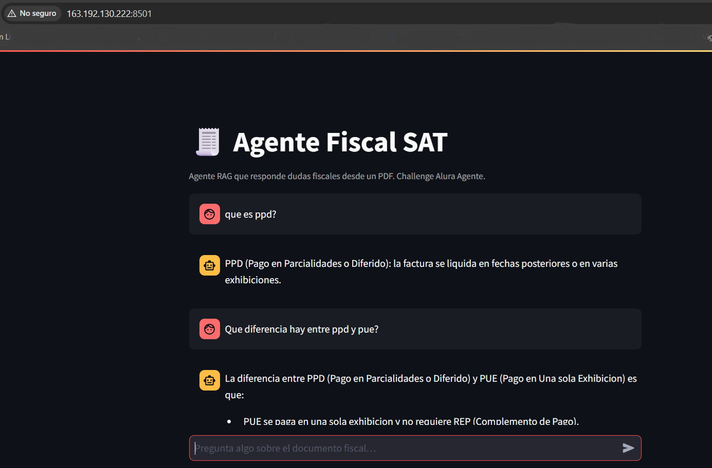

# Despliegue en Oracle Cloud Infrastructure (OCI)

Guía para desplegar el agente en una VM **Always Free** de OCI con Docker.

## 1. Crear la VM

1. Consola OCI → **Compute → Instances → Create Instance**.
2. Shape: `VM.Standard.A1.Flex` (ARM, Always Free) — 1 OCPU / 6 GB basta.
   - Alternativa x86: `VM.Standard.E2.1.Micro` (Always Free).
3. Imagen: **Canonical Ubuntu 22.04**.
4. Guarda la llave SSH pública. Anota la **IP pública**.

## 2. Abrir el puerto 8501

- **VCN → Security List → Ingress Rules → Add**:
  - Source CIDR `0.0.0.0/0`, protocolo TCP, puerto destino `8501`.
- En la VM (firewall del SO):
  ```bash
  sudo iptables -I INPUT 6 -m state --state NEW -p tcp --dport 8501 -j ACCEPT
  sudo netfilter-persistent save
  ```

## 3. Instalar Docker

```bash
ssh ubuntu@<IP_PUBLICA>
sudo apt update && sudo apt install -y docker.io git
sudo usermod -aG docker ubuntu && newgrp docker
```

## 4. Desplegar

```bash
git clone <tu-repo> && cd challenge-alura-agente
# sube tu PDF a data/guia_fiscal_sat.pdf (scp o git)
docker build -t agente-fiscal .
docker run -d --restart unless-stopped -p 8501:8501 \
  -e GROQ_API_KEY=gsk_... --name agente agente-fiscal
```

## 5. Verificar

Abre `http://<IP_PUBLICA>:8501` → captura de pantalla para el entregable.

### Evidencia (checklist entregable)
- [x] URL pública funcionando: [http://163.192.130.222:8501](http://163.192.130.222:8501)
- [x] Captura de la app respondiendo una pregunta

  

- [x] `docker ps` mostrando el contenedor `Up`

  ```
  CONTAINER ID   IMAGE           COMMAND                  CREATED          STATUS                    PORTS                                         NAMES
  561fd4daf22c   agente-fiscal   "streamlit run main.…"   18 minutes ago   Up 18 minutes (healthy)   0.0.0.0:8501->8501/tcp, [::]:8501->8501/tcp   agente
  ```
